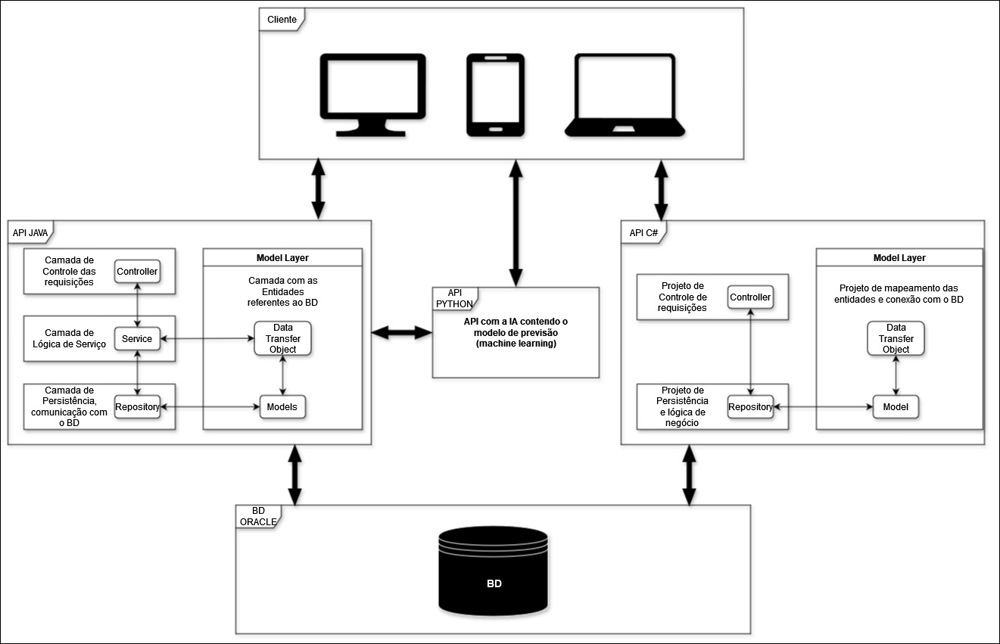

# IntelliStocks.NET

**IntelliStocks** é uma solução inovadora de gerenciamento de inventário que utiliza **aprendizado de máquina** e **análise de dados** para antecipar demandas, otimizar estoques e automatizar reabastecimentos. Com uma **interface intuitiva**, oferece **insights valiosos** para a tomada de decisões informadas, impulsionando a **eficiência operacional** e a **competitividade** das empresas.

O projeto **IntelliStocks** não só revolucionará o gerenciamento de inventário, mas também contará com um robusto **sistema de controle de gerenciamento de empresas**. Esse sistema permitirá que empresas possam organizar suas **tarefas**, registrar **notas importantes** e agendar **eventos** de forma eficiente. A integração dessas funcionalidades garantirá que as empresas tenham uma **visão completa das operações**, desde a gestão de estoques até o planejamento estratégico, tudo em um único ambiente.

Recursos como **alertas automatizados via email** e um **painel de controle centralizado** proporcionarão ainda mais controle e organização. Dessa forma, o **IntelliStocks** se tornará uma ferramenta essencial tanto para a **gestão operacional** quanto para o **planejamento estratégico** das empresas.

# Implementação da API

## Arquitetura e Decisões de Design

Para esta API, optei por usar a arquitetura **MVC (Model-View-Controller)**, combinada com uma abordagem de **microserviços**. Essa escolha foi motivada pela necessidade de integrar duas APIs diferentes uma feita em .NET e outra em Spring Boot dentro de um único projeto front-end.

## Por que escolhi microserviços?

A escolha por microserviços se deve à flexibilidade e escalabilidade que essa abordagem oferece. Ao separar as APIs em serviços independentes, conseguimos desenvolver e manter cada uma delas de forma autônoma, sem que mudanças em uma impactem diretamente a outra.

### Vantagens dessa abordagem:

- **Desenvolvimento separado**: Tanto a API em .NET quanto a em Spring Boot podem evoluir independentemente.
- **Escalabilidade**: Podemos escalar as APIs conforme a necessidade, sem sobrecarregar o sistema como um todo.
- **Integração eficiente**: No front-end, conseguimos consumir as duas APIs ao mesmo tempo, aproveitando o melhor de cada tecnologia.
- **Facilidade na manutenção**: A divisão em microserviços ajuda a manter o código mais organizado, facilitando futuras manutenções.

Essa estrutura garante que o sistema seja modular e flexível, além de nos permitir aproveitar o melhor de cada tecnologia de forma integrada e eficiente.


Confira o vídeo de entrega da Spring 3, contendo objetivos do projeto e :


Confira o vídeo do pitch do nosso projeto no link abaixo:  
[Assista ao Pitch](https://youtu.be/lpCFoGbBxmY)

Confira o vídeo de entrega da Spring 3, contendo objetivos do projeto e :[Link do vídeo](https://youtu.be/D1EEw_oR_Ec)

Projeto Java: [https://github.com/IgorLuiz777/IntelliStocksApi](https://github.com/IgorLuiz777/IntelliStocksApi) 

Projeto Mobile: [https://github.com/lucasrychlicki/IntelliStocks](https://github.com/lucasrychlicki/IntelliStocks)

Projeto IA: [https://github.com/CastanhoPh/IntelliStocksAI](https://github.com/CastanhoPh/IntelliStocksAI)

## Sprints

### SPRINT 1
#### Equipe:
- **Gustavo Monte (RM 551601)** - Compliance, Quality Assurance & Tests | Mobile Application Development  
- **Igor Luiz (RM 99809)** - Java Advanced | Disruptive Architectures: IoT, IoB & Generative AI
- **Lucas Lima (RM 551253)** - DevOps Tools & Cloud Computing | Disruptive Architectures: IoT, IoB & Generative AI
- **Murilo Caumo (RM 551247)** - Mastering Relational and Non-Relational Databases
- **Pedro Henrique (RM 551598)** - Advanced Business Development with .NET

### SPRINT 2
#### Equipe:
- **Gustavo Monte (RM 551601)** - Compliance, Quality Assurance & Tests
- **Igor Luiz (RM 99809)** - Java Advanced | Advanced Business Development with .NET
- **Lucas Lima (RM 551253)** - Mobile Application Development | DevOps Tools & Cloud Computing
- **Murilo Caumo (RM 551247)** - Mastering Relational and Non-Relational Databases
- **Pedro Henrique (RM 551598)** - Mastering Relational and Non-Relational Databases
- **GRUPO** - Disruptive Architectures: IoT, IoB & Generative AI

### SPRINT 3
#### Equipe:
- **Gustavo Monte (RM 551601)** - Compliance, Quality Assurance & Tests
- **Igor Luiz (RM 99809)** - Java Advanced | Advanced Business Development with .NET
- **Lucas Lima (RM 551253)** - Mobile Application Development | DevOps Tools & Cloud Computing
- **Murilo Caumo (RM 551247)** - Mastering Relational and Non-Relational Databases
- **Pedro Henrique (RM 551598)** - Disruptive Architectures: IoT, IoB & Generative AI
 
**Nota:** Embora cada membro tenha responsabilidades específicas, 
todos contribuem em todas as disciplinas e para o projeto como um todo.

## Arquitetura - Camadas




## Tarefas

- [x] CRUD Tarefas
- [x] CRUD Anotações
- [x] CRUD Eventos
- [ ] Autenticação + Usuário
- [ ] Refatoramento
- [x] Documentação

## Como rodar
Aqui está o passo a passo para configurar o projeto **IntelliStocks.NET** em diferentes IDEs e começar a trabalhar no código:
### 1. Clonar o repositório:
Abra o terminal e execute o seguinte comando para clonar o repositório:
```bash
git clone https://github.com/IgorLuiz777/IntelliStocks.NET
```
Depois, navegue para a pasta do projeto:
```bash
cd ./IntelliStocks.NET
```
### 2. Abrir a solução o arquivo .sln

### 3. Confirir as dependêcnias do Nuget

### 3. Rodar em formato http

## Documentação da API

### Documentação feita utilizando o Swagger ([saiba mais](https://swagger.io/)).
Para acessar a documentação, basta rodar o projeto e depois navegar no seu navegador de sua preferência para: [http://localhost:5205/swagger/index.html](http://localhost:5205/swagger/index.html).

## Testes

### Postman
Link do workspace do postman - https://www.postman.com/speeding-satellite-21324/intellistocks </br>
Ou import o json 'INTELLISTOCKS API - C#.postman_collection.json' na pasta raiz do projeto para dentro do postman.
